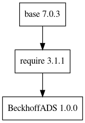

e3-BeckhoffADS  
======
ESS Site-specific EPICS module : BeckhoffADS

## Dependency Plot

||
| :---: |
|**Figure 1** Depdendency Tree. |

## ESS forked version of BeckhoffADS

* ESS v1.0.0 is equal to the hash `56bc355c7eeb38bb4400b939037a256984742ded`

